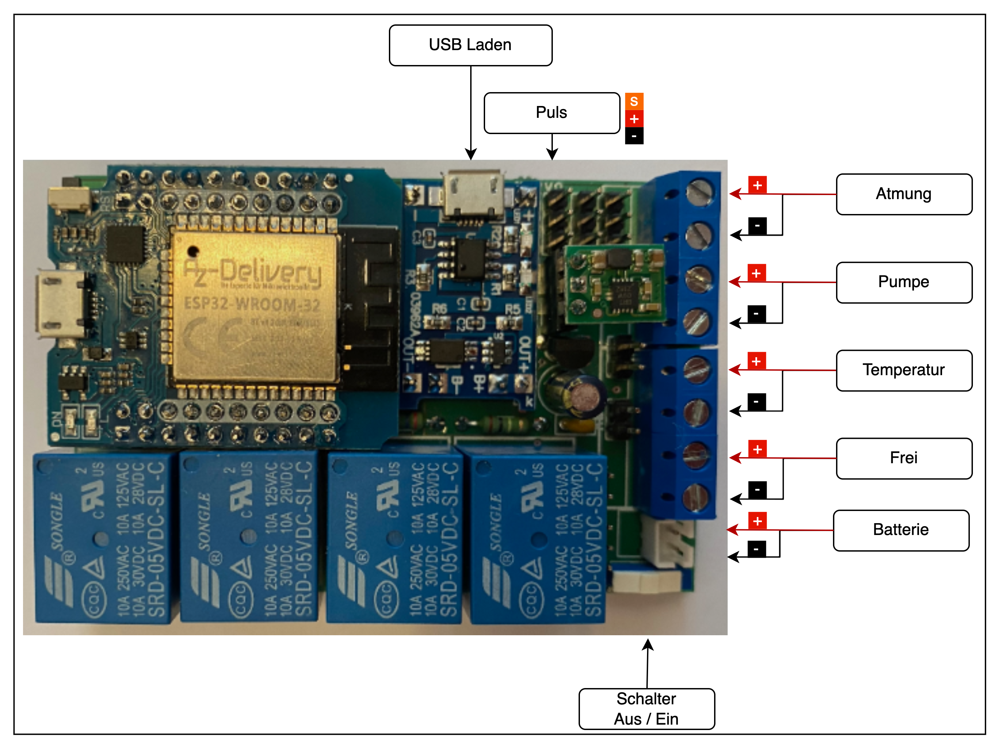

# Cardio pulmonary resuscitation Dummy (CPRD)

## CPRD ist eine Simulations Hard- bzw. Software welche dafür eingesetzt werden kann um folgende Themen zu simulieren

- Blutkreislauf
  Es kann ein Relais für einen konfigurierbaren Zeitraum ein, bzw. ausgeschaltet werden.
- Beatmung
  Es kann ein Relais für einen konfigurierbaren Zeitraum ein, bzw. ausgeschaltet werden.
- Temperatur
  Es kann ein Relais für einen konfigurierbaren Zeitraum ein, bzw. ausgeschaltet werden.
- Puls
  Der angeschlossene Servo kann so konfiguriert werden, um einen Puls nachzuahmen.
- ✨Magic ✨

## Merkmale

Die globalen Parameter werden hier kurz beschrieben:

* Buttons
  * Speichern -> Speichern der Parameter im EEPROM
  * Start -> Starte mit den aktuell sichtbaren Parametern
  * Abbrechen -> Veränderungen rückgängig machen (nur solange nicht gespeichert wurde)
* Parameter (x)
  * Jeglicher Parameter kann mittels dem Schieberegler konfiguriert werden.
    Der aktuelle Wert wird im Text angezeigt.

##### Blutkreislauf


* Start Blut alle x Sekunden
* Blut rinnt für x Sekunden

##### Beatmung (Lunge)


* Starte Atmung alle x Sekunden
* Atmung läuft für x Sekunden

##### Körpertemperatur (Fieber)


* Temperatur läuft für x Sekunden

And of course Dillinger itself is open source with a [public repository][dill]
on GitHub.

## Anzeigen

### Zuhause (Home)

Die Hauptansicht zeigt immer alle derzeit verwendeten Boards an.
Das derzeit aktive "Master Board" ist zusätzlich mit einem "m" markiert.
Sollte ein Board einen zu geringen Batteriestatus haben, wird dies am jeweiligen Board im Menü angezeigt.

* Batterie < 90% = GELB
* Batterie < 80% = ROT


Sollten Boards nicht mehr aktiv sein (z.B. ausser Reichweite, Batterie leer), werden diese
im linken Baum als "ausgegraut" dargestellt:


### Menü

Über das Menü links unten können folgende Seiten geöffnet werden.
Dies funktioniert nur bei ausgewähltem Board, da diese Seiten Echtzeitdaten verwenden.


##### Settings

In dieser Seite können folgende Parameter konfiguriert werden:

* Board ID
  Diese sollte nur verändert werden, wenn es zu einem Konflikt mit einem anderen Board kommt, welche die gleiche ID verwendet.
* SSID
  Es ist möglich eine eigene WLAN SSID zu vergeben, z.B. um mehrere "Master" gleichzeitig verwenden zu können.


* Save
  Speichern der Daten im EEPROM
* Reset
  Zurückstellen aller Einstellungen auf den Auslieferungszustand (Board wird neu gestartet)
* Reboot
  Board wird neu gestartet

##### About

Anzeige der aktuellen Versionen bzw. der zusätzlich verwendeten Software.


##### Update

Um ein Board aktualisieren zu können, muss es zwingend als "Master" Board aktiv sein.
Für die Aktualisierung der Software wird die Auswahl

* Firmware
  und
* firmware.bin
  verwendet.

Für die Aktualisierung der Oberfläche (Webseiten) wird

* Filesystem
  und
* spiffs.bin
  verwendet.


##### Ping

Das derzeit gewählte Board fängt mittels der blauen LED zu blinken an.
Somit können die einzelnen Boards aufgefunden werden.

## Anschlüsse

Das System besitzt folgende Anschlüsse (derzeit aktiviert/programmiert):

* USB Laden
  Hierfür kann ein handelsübliches USB Ladegerät verwendet werden.
  Es darf ausschliesslich nur im abgeschalteten Zustand geladen werden.
  Die LED Anzeige besitzt zwei Zustände
  * Rot: Batterie wird geladen
  * Blau: Batterie ist geladen
* Atmung
  5 Volt Ausgang +/-
* Pumpe
  5 Volt Ausgang +/-
* Temperatur
  5 Volt Ausgang +/-
* Batterie
  Es darf ausschliesslich mit 1S LiPo bzw. 1S LiIon Batterien (z.B. 18650) gearbeitet werden.
  Wenn das Board nicht genutzt wird, sollte die Batterie abgesteckt werden.
* Schalter
  Das Board sollte im nicht genutzten Zustand immer ausgeschaltet werden.



* Folgende Pins sind derzeit schon auf dem Board vorhanden aber noch nicht aktiv im Einsatz:
  * Relais 4 (Frei)
  * 5 Volt (+/-)
  * 3 Volt (+/-)
  * MISO, MOSI, SS, SCK (z.B. um eine SD Karte anzuschliessen)
  * SDA, SCL (z.B. für externe Sensoren [Temperatur, Luftfeuchte])
  * GPIO1 (TXD)
  * GPIO3 (RXD)

## Development

Die Programmierung erfolgt mittels Visual Studio Code und PlatformIO.

```sh
todo
```

#### Bin Dateien erzeugen (OTA Update)

> Note: `to be` defined.

## Issues

Derzeit kommt es vereinzelt zu Ausfällen wenn der Puls gestartet wird. Es wird ein Neustart des Boards durchgeführt.

## License

GPL v2

**Free Software, Hell Yeah!**
